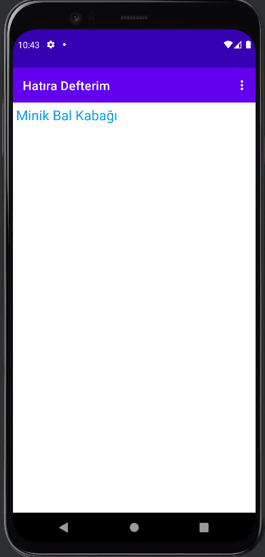
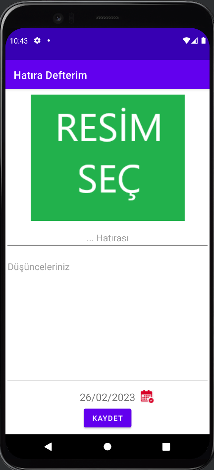
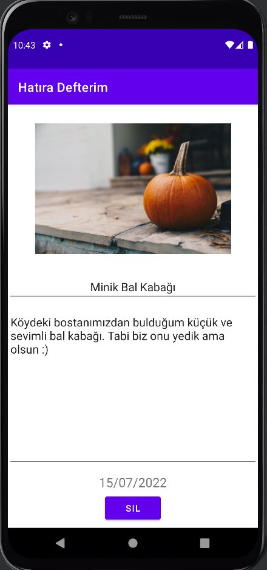

# Son Güncelleme: 26/02/2023
* Bu uygulamada, bir aydır üzerinde çalıştığım Android ve Kotlin derslerinden öğrendiğim bilgileri kullanmaya çalıştım.  
* Uygulama adından da anlışacağı üzere, hatıralarımızı tek bir yerde biriktirdiğimiz bir uygulama.  
* Doğrudan app-debug.apk dosyasını indirirek uygulamayı kullanabilirsiniz.  
* Uygulamada kullandığım bilgiler:  
  * View Binding
  * Layouts
  * RecyclerView
  * Intent
  * Menu
  * ActivityResultLauncher for Permissions (READ_EXTERNAL_STORAGE / READ_MEDIA_IMAGES)
  * Fragment
  * Room Database
  * RxJava 3 - CompositeDisposable
  * Navigation (Action & Arguments)
  * DatePicker
---
## Uygulamadan Ekran Görüntüleri

Ana Ekran

  

---

Hatıra Ekleme Ekranı

  

---

Hatıra Görüntüleme Ekranı

  

